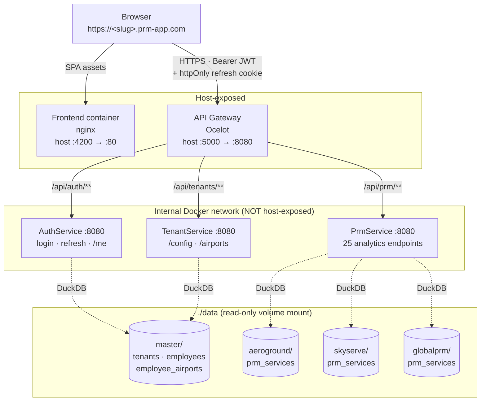
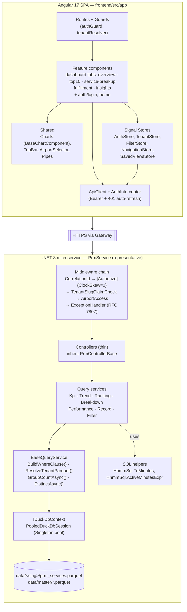
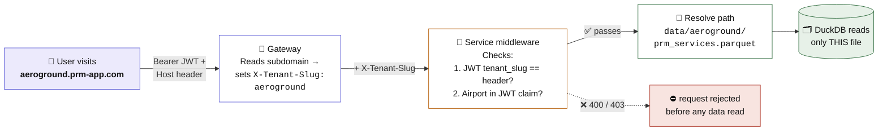
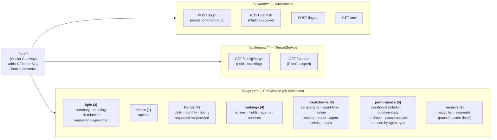

# PRM Dashboard

Multi-tenant analytics POC for **Passenger with Reduced Mobility (PRM)** ground handling services. Airports and ground-handling companies use this to monitor wheelchair assists, medical-assist services, and other accessibility operations across their locations.

> **Status:** POC feature-complete. Runtime data layer is DuckDB over per-tenant Parquet; seed CSVs + generated Parquet are committed under `data/`. **172/172 backend tests + 1/1 frontend tests passing.** See [docs/e2e-checklist.md](docs/e2e-checklist.md) for manual verification scenarios.

## What it does

- **Multi-tenant** — each ground handler (AeroGround, SkyServe, GlobalPRM, …) has its own isolated dataset, addressed via tenant subdomain (`aeroground.prm-app.com`, etc.)
- **Per-tenant Parquet files** — runtime services read `data/{slug}/prm_services.parquet` directly via DuckDB. The slug → file path mapping is a pure string convention; no DB lookup, no inter-service HTTP for tenant resolution
- **Airport-level RBAC** — employees only see data for airports they're assigned to (enforced by JWT claim + server-side middleware)
- **5-tab dashboard** — Overview, Top 10, Service Breakup, Fulfillment, Insights — with ~17 interactive ECharts visualizations, cross-filtering, drill-down, and 16 date-range presets

---

## Architecture

### Service topology



Gateway is the only host-exposed backend service (`${GATEWAY_PORT:-5000}:8080`). Auth / Tenant / PRM are reachable only on the internal Docker network. The frontend container is exposed on host port 4200. Gateway has `depends_on: service_healthy` wiring so it won't accept traffic until all three backends are healthy.

### Layered architecture

Inside each runtime service:



AuthService and TenantService follow the same shape; their query services read `master/employees.parquet` and `master/tenants.parquet` respectively via the same `IDuckDbContext` + `BaseQueryService` stack.

### Request flow (authenticated dashboard call)

```text
GET /api/prm/kpis/summary?airport=DEL&date_from=…&date_to=…
Host: aeroground.prm-app.com
Authorization: Bearer <JWT>

  1. Angular AuthInterceptor attaches Bearer token
  2. Ocelot Gateway
       ├─ extracts slug "aeroground" from Host → adds X-Tenant-Slug: aeroground
       └─ forwards to http://prm:8080
  3. PrmService middleware chain:
       ├─ CorrelationIdMiddleware            → adds X-Correlation-Id
       ├─ [Authorize] (JwtBearer, ClockSkew=0)
       ├─ TenantSlugClaimCheckMiddleware     → 400 if header missing, 403 if header≠claim
       ├─ AirportAccessMiddleware            → 403 if any ?airport= not in JWT airports[]
       └─ ExceptionHandlerMiddleware         → catches + maps to RFC 7807 ProblemDetails
  4. KpiService / ranking / trend / …
       ├─ BaseQueryService.ResolveTenantParquet("aeroground")
       │     → data/aeroground/prm_services.parquet (or 404 if missing)
       ├─ BaseQueryService.BuildWhereClause(filters)
       │     → (sqlFragment, DuckDBParameter[])
       ├─ await using session = await _duck.AcquireAsync(ct)
       ├─ runs parameterised SQL against the parquet path
       └─ returns typed DTO → JSON
```

Each runtime service uses `DuckDB.NET` to query Parquet directly — no ORM, no `DbContext`, no inter-service HTTP for tenant resolution. Refresh tokens live in `InMemoryRefreshTokenStore` (process-local; restart forgets all sessions — POC compromise).

### Data pipeline

The human-readable source of truth is the **CSV files committed under `data/`**. The `*.parquet` siblings are the query format that runtime services actually read, and are regenerated from the CSVs by `backend/tools/PrmDashboard.ParquetBuilder` (DuckDB-embedded; no external database).

```text
data/{slug}/prm_services.csv  ── ParquetBuilder ──▶  data/{slug}/prm_services.parquet
data/master/*.csv             ── ParquetBuilder ──▶  data/master/*.parquet
```

---

## Setup

### Prerequisites

- **Docker Desktop** (with Compose v2). Only hard requirement for the "run the stack" path below.
- **.NET 8 SDK** + **Node.js 20 LTS** — only if you want to build/run services locally outside Docker, or regenerate Parquet after editing a CSV.
- **Git** — to clone.

### 1. Clone + environment file

```bash
git clone https://github.com/cosmo666/prm-dashboard.git
cd prm-dashboard
cp .env.example .env
```

### 2. Set a real JWT secret (REQUIRED)

`JwtStartupValidator` refuses to start any backend service if `Jwt:Secret` contains the placeholder `change-in-production` or is shorter than 32 bytes. Edit `.env` and replace:

```bash
# Generate a 32+ byte secret:
openssl rand -base64 48     # macOS/Linux
# PowerShell:
#   [Convert]::ToBase64String((1..48 | %{[byte](Get-Random -Max 256)}))
```

Paste the result into `.env`:

```dotenv
JWT_SECRET=<paste-your-base64-secret-here>
```

The gateway, auth, tenant, and prm containers each fail-fast with a clear error message if the secret is missing, too short, or still the placeholder.

### 3. Seed data — already committed

The repo ships committed CSVs **and** pre-generated Parquet under `data/` (master + 3 tenant slugs: `aeroground`, `skyserve`, `globalprm`). No regeneration needed for a fresh clone — you only need to rebuild Parquet if you edit a CSV (see **Refreshing the seed data** below).

---

## Run

### Quick start (Docker)

```bash
docker compose up -d --build                # build + start in the background
```

This brings up five containers — `prm-gateway` (host :5000), `prm-auth`, `prm-tenant`, `prm-prm` (internal only), and `prm-frontend` (host :4200). Gateway has `depends_on: service_healthy` wiring so it won't accept traffic until the three backends are healthy.

### URLs

Once `docker compose up` is running, open any of these:

| Service | URL | What it is |
| --- | --- | --- |
| **Frontend — bare localhost** | <http://localhost:4200> | Opens the app with a dev-only dropdown in the top bar to pick a tenant. Easiest path on a fresh machine. |
| **Frontend — AeroGround tenant** | <http://aeroground.localhost:4200> | Prod-like URL; `TenantResolver` picks the slug `aeroground` from the subdomain automatically. |
| **Frontend — SkyServe tenant** | <http://skyserve.localhost:4200> | Same pattern, slug `skyserve`. |
| **Frontend — GlobalPRM tenant** | <http://globalprm.localhost:4200> | Same pattern, slug `globalprm`. |
| **API Gateway** | <http://localhost:5000/api> | All backend calls; every request needs `Authorization: Bearer <jwt>` and `X-Tenant-Slug`. Try <http://localhost:5000/api/tenants/config?slug=aeroground> for an anonymous branding check. |

The three backend services (`auth`, `tenant`, `prm`) are **intentionally not exposed to the host** — they're reachable only from inside the Docker network. Use the gateway as the single API entry point.

> **`*.localhost` resolution.** Chrome, Edge, and Firefox resolve `*.localhost` to `127.0.0.1` automatically per RFC 6761 — no hosts-file edit needed. If your browser doesn't (older Safari, some corporate DNS), add the following to `C:\Windows\System32\drivers\etc\hosts` (requires admin):
>
> ```text
> 127.0.0.1  aeroground.localhost skyserve.localhost globalprm.localhost
> ```

### Common commands

```bash
docker compose ps                          # what's running
docker compose logs -f frontend            # tail logs for one service
docker compose up -d --build frontend      # rebuild + restart just the frontend (UI changes)
docker compose restart auth tenant prm     # restart backends (e.g. after refreshing Parquet)
docker compose stop                        # stop containers (keep state)
docker compose down                        # tear it all down
```

### Local dev (without Docker)

Run each service in its own terminal:

```bash
cd backend
dotnet build                                                    # one-time
dotnet run --project src/PrmDashboard.AuthService     # :5001 via launchSettings
dotnet run --project src/PrmDashboard.TenantService   # :5002
dotnet run --project src/PrmDashboard.PrmService      # :5003
dotnet run --project src/PrmDashboard.Gateway         # :5000
```

```bash
cd frontend
npm install           # one-time
npm start             # ng serve :4200 with /api → http://localhost:5000 proxy
```

Set `Jwt__Secret`, `Jwt__Issuer`, `Jwt__Audience`, and `PRM_DATA_PATH` (pointing at the repo's `data/` directory) in each service's environment or `appsettings.Development.json`.

### Refreshing the seed data

Edit any CSV under `data/`, then rebuild the sibling `*.parquet`:

```bash
dotnet run --project backend/tools/PrmDashboard.ParquetBuilder -- --dir ./data
docker compose restart auth tenant prm     # so services pick up the new Parquet
```

ParquetBuilder uses embedded DuckDB (`COPY … FORMAT 'parquet'`) — no external database or extra tooling required. Every conversion is self-checked with a round-trip row-count assertion; exit code is non-zero if any file drifts.

---

## Build & Test

```bash
# Backend — 172/172 tests passing
cd backend
dotnet build                                          # 0 errors, 0 warnings
dotnet test                                           # xUnit

# Frontend — 1/1 test passing, lint clean
cd frontend
npm install
npm run lint                                          # 0 errors (28 intentional no-explicit-any warnings)
npm test                                              # Karma + Jasmine headless
npx ng build --configuration production               # production bundle
```

Then walk the [E2E checklist](docs/e2e-checklist.md) for manual verification.

---

## Tech Stack

| Layer | Technology | Version |
|---|---|---|
| **Backend runtime** | .NET | 8.0 |
| **Backend framework** | ASP.NET Core Web API | 8.0 |
| **Runtime data layer** | DuckDB.NET (reading Parquet) | 1.5.0 |
| **Storage format** | Apache Parquet (per-tenant + master files under `data/`) | - |
| **Seed format** | CSV committed under `data/`; refreshed to Parquet via `PrmDashboard.ParquetBuilder` | - |
| **Refresh-token store** | `InMemoryRefreshTokenStore` (process-local) | - |
| **Auth — password hashing** | BCrypt.Net-Next | 4.0.3 |
| **Auth — JWT** | System.IdentityModel.Tokens.Jwt | 7.6.2 |
| **API Gateway** | Ocelot | 23.2.0 |
| **Frontend framework** | Angular (standalone components) | 17+ |
| **UI library** | Angular Material 3 | 17.3 |
| **Charts** | Apache ECharts via ngx-echarts | - |
| **Frontend state** | NgRx Signal Store (@ngrx/signals) | - |
| **Language** | TypeScript (strict mode) | 5.x |
| **Styling** | SCSS with CSS custom properties | - |
| **Container orchestration** | Docker Compose (images pinned by sha256 digest) | - |

---

## Multi-Tenant Flow

### How tenant isolation works

**The idea in one sentence.** Every customer (tenant) lives in its own folder on disk. A request for AeroGround's data can *only* read from `data/aeroground/` — there's no shared database, no shared table with a `tenant_id` column, no risk of a buggy `WHERE` clause leaking rows from another customer. Each tenant's data is a separate file.

**How we pick which folder to read.** Everything flows from the URL you typed. If you visit `aeroground.prm-app.com`, the word *aeroground* (called the **slug**) is extracted from the subdomain and used to compute a file path: `data/aeroground/prm_services.parquet`. That's it — the slug is a plain string, and the path is just `data/` + slug + `/prm_services.parquet`. No database lookup, no service call, no cache. A pure string concatenation.



The whole flow in five words: **subdomain → slug → header → file → rows.** No two tenants can ever touch each other's data because no two tenants share a file.

Here's the full journey of a request, step by step:

#### 1. Page loads — pick up the tenant from the URL

You open `https://aeroground.prm-app.com` in your browser.

- The Angular app's **`TenantResolver`** reads `window.location.hostname`, splits on `.`, and takes the first piece → slug = `aeroground`.
- It calls `GET /api/tenants/config?slug=aeroground` to fetch branding (tenant name, logo, primary color) and stores it in `TenantStore` so the top bar renders the right name and colors.
- At this point nothing is authenticated yet — `/api/tenants/config` is a public endpoint.

#### 2. User logs in

You enter a username + password and submit.

- Angular sends `POST /api/auth/login` with the header `X-Tenant-Slug: aeroground` and body `{ username, password }`.
- The **Auth Service** looks up `aeroground`'s `tenant_id` from its in-memory dictionary (loaded from `master/tenants.parquet` at startup) and queries `master/employees.parquet` with a filter like "tenant_id = 1 AND username = 'admin'".
- It checks the password with **BCrypt**.
- On success it issues a **JWT** (JSON Web Token) stamped with five claims:
  - `sub` — the employee's numeric ID
  - `tenant_id` — the tenant this employee belongs to
  - `tenant_slug` — the slug, e.g. `"aeroground"` (used to double-check every later request)
  - `name` — the display name
  - `airports` — a comma-separated list of airport codes the employee is allowed to see (e.g. `"BLR,HYD,DEL"`)
- It also sets an **httpOnly refresh cookie** (7 days, Secure, SameSite=Strict) so the browser can silently renew the access token later.
- The JWT is held in memory by `AuthStore` (not localStorage — XSS-safe). The refresh cookie is invisible to JavaScript.

> **Two independent checks baked into the JWT.** The token carries both *which tenant you belong to* and *which airports you're allowed to see*. Every later request gets re-validated against both.

#### 3. You click around the dashboard

Every API call (loading KPIs, charts, tables) goes through the same pipeline:

1. **Angular's `AuthInterceptor`** attaches `Authorization: Bearer <jwt>` and `withCredentials: true` (so the refresh cookie tags along).
2. **The Ocelot Gateway** (the only entry point for `/api/**`) receives the request. It reads the `Host` header (`aeroground.prm-app.com`), extracts the subdomain, and injects an `X-Tenant-Slug: aeroground` header before forwarding to the downstream service. This is the *one* place the slug is set from the outside — downstream services trust only this header.
3. **The downstream service** (Auth / Tenant / PRM) runs a small middleware chain:
   - `[Authorize]` verifies the JWT's signature + expiry. `ClockSkew = TimeSpan.Zero` makes the 15-minute lifetime *actually* 15 minutes (Material's default adds 5-minute grace that effectively made it 20).
   - **`TenantSlugClaimCheckMiddleware`** is the key defense-in-depth check. For any authenticated request it compares:
     - The gateway-injected `X-Tenant-Slug` header, with
     - The `tenant_slug` claim inside the JWT.
     If the header is missing → **400 Bad Request** (the request didn't come through the gateway, so something is off). If the header and claim don't match → **403 Forbidden** (someone is trying to query a different tenant with their own token). Both presence AND match are required.
   - **`AirportAccessMiddleware`** (PrmService only) inspects the `?airport=` query param. Every airport code requested — whether one or a comma-separated list like `DEL,BOM` — is checked against the `airports` claim in the JWT. A single mismatch → **403 Forbidden**. No other filter even gets evaluated.

#### 4. The query finally runs

Only after all the checks above does the service reach the business logic:

- **`BaseQueryService.ResolveTenantParquet("aeroground")`** returns the escaped path `data/aeroground/prm_services.parquet`. If the file doesn't exist (e.g., a new tenant was onboarded but the Parquet hasn't been rebuilt yet) this throws `TenantParquetNotFoundException` → the exception middleware maps it to a clean **404 Not Found**, *not* a cryptic 500.
- **`BaseQueryService.BuildWhereClause(filters)`** turns the common filter parameters (date range, airline, service type, etc.) into a SQL fragment + parameter list.
- A DuckDB session is borrowed from the pool, the SQL runs against *that one Parquet file*, and the typed DTO is returned as JSON.

Because the Parquet path was hardcoded to the tenant's slug, there is no way — even in principle — for the SQL to see another tenant's rows. The data is physically separate.

### Tenant resolution chain (at a glance)

```text
Subdomain → slug (X-Tenant-Slug header) → data/{slug}/prm_services.parquet → DuckDB query
              ▲                                                          ▲
              │                                                          │
              └─ set by the gateway                                      └─ parameterised SQL
                 (never trusted from the browser)                            (never string-concat user input)
```

### Why this approach

- **No cross-tenant data leakage.** Each request resolves to exactly one tenant's Parquet file via a pure string function. There is no shared table where a missed `WHERE tenant_id = ?` could reveal another tenant's data — the wrong path simply can't be constructed.
- **No lookup cost.** Slug → file path is `Path.Combine(root, slug, "prm_services.parquet")`. No database call, no HTTP hop, no cache to invalidate.
- **No schema migration system.** The Parquet file *is* the schema. To evolve a column, edit the CSV and re-run `PrmDashboard.ParquetBuilder`. Extra columns in a Parquet file are ignored; missing columns break the read loudly.
- **Defense-in-depth against path traversal.** `TenantParquetPaths.TenantPrmServices(slug)` validates the slug against the regex `^[a-z][a-z0-9-]{0,49}$` *before* calling `Path.Combine`. A malicious slug like `../master` or `../../etc/passwd` is rejected with `ArgumentException` — the gateway and login flow already filter slugs in practice, but this is the last line of defense right before the filesystem operation.
- **RBAC as a second dimension.** Tenant isolation scopes *which customer's data*. Airport RBAC scopes *which subset of that customer's data*. Both happen server-side before the SQL layer ever sees the request; the Angular app can't send you into data you don't have a claim for, and even if it tried, the middleware would say 403.
- **JWT + header double-check.** The `tenant_slug` claim inside the JWT and the `X-Tenant-Slug` header injected by the gateway must agree. Stealing a JWT from tenant A and trying to replay it against tenant B's subdomain fails with a 403 — the gateway rewrites the header to match the subdomain, so the two values diverge and the middleware rejects the request.

### Onboarding a new tenant

1. Append a row to `data/master/tenants.csv` — `id`, `name`, `slug`, `is_active`, `created_at`, `logo_url`, `primary_color`.
2. Append employees + airport assignments to `data/master/employees.csv` and `data/master/employee_airports.csv`.
3. Create the tenant's `data/{slug}/prm_services.csv` with the columns documented below.
4. Run `dotnet run --project backend/tools/PrmDashboard.ParquetBuilder -- --dir ./data` to refresh every sibling `*.parquet`.
5. Restart the `auth` and `tenant` services so `TenantsLoader.StartAsync` picks up the new tenant in its startup dictionary. (`prm` doesn't need a restart — it computes the path lazily per request.)
6. Point `{slug}.prm-app.com` DNS at the Angular app.

If a tenant's parquet file is missing at request time (e.g., onboarded but Parquet hasn't been rebuilt yet), PRM Service returns **404 Not Found** via `TenantParquetNotFoundException`, not a 500.

---

## How dashboard filters work

Filters are the central UX in this dashboard — every chart, KPI card, and table reacts to the same filter set. The flow is:

```mermaid
sequenceDiagram
    autonumber
    actor User
    participant URL as Browser URL
    participant FS as FilterStore<br/>(Signal Store)
    participant Tab as Dashboard Tab<br/>component
    participant API as ApiClient +<br/>AuthInterceptor
    participant GW as Gateway<br/>(Ocelot)
    participant MW as PrmService<br/>middleware chain
    participant QS as Query Service<br/>(e.g. KpiService)
    participant BQ as BaseQueryService
    participant DB as DuckDB +<br/>Parquet

    User->>FS: selects airline "AI"<br/>(AirportSelector / FilterBar / DateRangePicker)
    FS->>URL: sync → ?airport=DEL&airline=AI&date_from=…
    FS-->>Tab: signal fires → computed() re-evaluates
    Tab->>API: GET /api/prm/kpis/summary?airport=DEL&airline=AI
    API->>GW: + Authorization: Bearer &lt;JWT&gt;<br/>+ Host: aeroground.prm-app.com
    GW->>MW: + X-Tenant-Slug: aeroground<br/>(derived from subdomain)
    MW->>MW: JwtBearer (ClockSkew=0)<br/>TenantSlugClaimCheck (presence + match)<br/>AirportAccess (every ?airport= ∈ JWT airports[])
    MW->>QS: request reaches controller → KpiService
    QS->>BQ: BuildWhereClause(filters)
    BQ-->>QS: (sqlFragment, DuckDBParameter[])
    QS->>BQ: ResolveTenantParquet("aeroground")
    BQ-->>QS: data/aeroground/prm_services.parquet<br/>(or throw → 404 if missing)
    QS->>DB: await using session;<br/>parameterised SELECT … FROM 'path'<br/>WHERE sqlFragment
    DB-->>QS: rows
    QS-->>Tab: typed DTO → JSON
    Tab->>Tab: render chart / KPI card

    Note over User,URL: Reloading the URL rehydrates FilterStore,<br/>so filters survive F5 and are shareable.
```

**Key invariants:**

- `FilterStore` is the single source of truth; every filter mutation goes through it (`setAirport`, `toggleAirport`, `setAirlines`, etc.). Components never mutate query params directly.
- URL is derived from the store, never the other way around in steady state — on reload, the store hydrates itself from URL once.
- `BaseQueryService.BuildWhereClause` is the **only** place `PrmFilterParams` becomes SQL. Adding a new filter means adding one clause there and one property to `PrmFilterParams` — every endpoint inherits support automatically.
- Every filter that can carry multiple values uses the same wire convention: one query param, comma-separated (`?airline=AI,UK`). `BaseQueryService` branches between equality (single value) and `IN (…)` (multi) per field.
- Airport is special: it's required AND validated server-side against the JWT `airports` claim before the SQL layer ever sees it. 403 on any mismatch.

---

## Data layout

Everything under `data/` is committed. CSVs are the human-readable source; `*.parquet` siblings are what runtime services query. Parquet column names are snake_case and match the CSV headers 1:1.

### Master data → `data/master/*.{csv,parquet}`

#### `tenants`

| Column | Type | Notes |
|---|---|---|
| `id` | INT | Primary key |
| `name` | VARCHAR | Display name (appears in top-bar) |
| `slug` | VARCHAR | URL subdomain + path-segment identifier; validated against `^[a-z][a-z0-9-]{0,49}$` |
| `is_active` | BOOLEAN | Inactive tenants cannot authenticate |
| `created_at` | TIMESTAMP | ISO-8601 UTC |
| `logo_url` | VARCHAR (nullable) | Absolute or relative URL for the top-bar logo |
| `primary_color` | VARCHAR | 7-char hex (`#RRGGBB`) |

#### `employees`

| Column | Type | Notes |
|---|---|---|
| `id` | INT | Primary key |
| `tenant_id` | INT | FK → tenants(id) |
| `username` | VARCHAR | Unique per tenant |
| `password_hash` | VARCHAR | BCrypt (Next) hash |
| `display_name` | VARCHAR | Shown in top-bar |
| `email` | VARCHAR (nullable) | |
| `is_active` | BOOLEAN | Inactive employees cannot log in |
| `created_at` | TIMESTAMP | |
| `last_login` | TIMESTAMP (nullable) | Updated on successful login |

#### `employee_airports`

| Column | Type | Notes |
|---|---|---|
| `id` | INT | Primary key |
| `employee_id` | INT | FK → employees(id) |
| `airport_code` | VARCHAR | IATA code |
| `airport_name` | VARCHAR | Display name |

Unique on `(employee_id, airport_code)`. These rows feed the JWT `airports` claim and the Airport Selector dropdown.

### Per-tenant data → `data/{slug}/prm_services.{csv,parquet}`

#### `prm_services`

| Column | Type | Notes |
|---|---|---|
| `row_id` | INT | Monotonic primary key within the file |
| `id` | INT | Source-system PRM service ID — not unique; pause/resume creates multiple rows with the same `id` |
| `flight` | VARCHAR | Flight identifier (e.g., `AI2849`) |
| `flight_number` | INT | Numeric part of flight |
| `agent_name` | VARCHAR (nullable) | Handling agent display name |
| `agent_no` | VARCHAR (nullable) | Agent identifier |
| `passenger_name` | VARCHAR | |
| `prm_agent_type` | VARCHAR | `SELF` or `OUTSOURCED`; default `SELF` |
| `start_time` | INT | HHMM integer encoding (e.g., `1430` = 2:30 PM) |
| `paused_at` | INT (nullable) | HHMM; set on pause, cleared on resume |
| `end_time` | INT | HHMM |
| `service` | VARCHAR | IATA SSR code: WCHR, WCHC, WCHS, WCHP, MAAS, BLND, DEAF, STCR, DPNA |
| `seat_number` | VARCHAR (nullable) | |
| `scanned_by` | VARCHAR (nullable) | Device/scanner identifier |
| `scanned_by_user` | VARCHAR (nullable) | Operator who performed the scan |
| `remarks` | TEXT (nullable) | Free text |
| `pos_location` | VARCHAR (nullable) | Operational position at the airport |
| `no_show_flag` | VARCHAR (nullable) | `Y` if passenger was a no-show |
| `loc_name` | VARCHAR | Airport IATA code |
| `arrival` | VARCHAR (nullable) | Arrival airport IATA |
| `airline` | VARCHAR | Airline IATA code |
| `emp_type` | VARCHAR (nullable) | Employee category; default `Employee` |
| `departure` | VARCHAR (nullable) | Departure airport IATA |
| `requested` | INT | `1` = pre-requested, `0` = walk-up |
| `service_date` | DATE | Calendar date of service |

**Dedup pattern:** `ROW_NUMBER() OVER (PARTITION BY id ORDER BY row_id) = 1` (canonical) or `COUNT(DISTINCT id)` (count-only) — pause/resume creates multiple rows with the same `id`; the first (lowest `row_id`) is the canonical row holding the service's metadata. Duration = sum of active segments per `id` via `HhmmSql.ActiveMinutesExpr` — `(COALESCE(paused_at, end_time) − start_time)` in minutes, clamped ≥0.

---

## API surface

The gateway fans out `/api/**` to three services. The 25 PRM analytics endpoints are grouped by domain:



Every PrmService endpoint requires `Authorization: Bearer <token>` + `X-Tenant-Slug` header (injected by the gateway) and accepts the common filter param set documented below.

---

## API Reference

All PRM analytics endpoints require `Authorization: Bearer <token>` and accept the following common filter params:

| Query Param | Type | Description |
|---|---|---|
| `airport` | string | Required. IATA airport code, or comma-separated list (`DEL,BOM`). Every code validated against JWT airports claim. |
| `date_from` | date | Start date (YYYY-MM-DD) |
| `date_to` | date | End date (YYYY-MM-DD) |
| `airline` | string | Comma-separated IATA airline codes |
| `service` | string | Comma-separated service types |
| `handled_by` | string | Comma-separated: SELF, OUTSOURCED |
| `flight` | string | Single flight identifier |
| `agent_no` | string | Single agent number |

### Auth Service (`/api/auth`)

| Method | Endpoint | Auth | Description |
|---|---|---|---|
| POST | `/api/auth/login` | No (needs `X-Tenant-Slug` header) | Login, returns JWT + sets refresh cookie |
| POST | `/api/auth/refresh` | No (uses refresh cookie) | Rotate access token |
| POST | `/api/auth/logout` | Yes | Revoke refresh token, clear cookie |
| GET | `/api/auth/me` | Yes | Current employee profile |

**Login request:** `{ username: string, password: string }`

**Login response:** `{ accessToken: string, employee: { id, displayName, email, airports[] } }`

### Tenant Service (`/api/tenants`)

| Method | Endpoint | Auth | Description |
|---|---|---|---|
| GET | `/api/tenants/config?slug=X` | No | Tenant branding (name, logo, color) — served from startup-loaded dict |
| GET | `/api/tenants/airports` | Yes | Airports assigned to authenticated employee |

### KPI Endpoints (`/api/prm/kpis`)

| Method | Endpoint | Description |
|---|---|---|
| GET | `/api/prm/kpis/summary` | Total PRM, active agents, avg/agent/day, avg duration, fulfillment % (with previous period comparisons) |
| GET | `/api/prm/kpis/handling-distribution` | Self vs Outsourced counts |
| GET | `/api/prm/kpis/requested-vs-provided` | Pre-requested vs walk-up vs fulfilled |

### Filter Endpoints (`/api/prm/filters`)

| Method | Endpoint | Description |
|---|---|---|
| GET | `/api/prm/filters/options` | Available airlines, services, handlers, flights, date range for an airport |

### Trend Endpoints (`/api/prm/trends`)

| Method | Endpoint | Description |
|---|---|---|
| GET | `/api/prm/trends/daily` | Daily service counts + average line |
| GET | `/api/prm/trends/monthly` | Monthly aggregated counts |
| GET | `/api/prm/trends/hourly` | Day-of-week × hour-of-day heatmap matrix |
| GET | `/api/prm/trends/requested-vs-provided` | Daily requested vs provided overlay |

### Ranking Endpoints (`/api/prm/rankings`)

| Method | Endpoint | Params | Description |
|---|---|---|---|
| GET | `/api/prm/rankings/airlines` | `limit` (default 10) | Top airlines by PRM count |
| GET | `/api/prm/rankings/flights` | `limit` (default 10) | Top flights by PRM count |
| GET | `/api/prm/rankings/agents` | `limit` (default 10) | Agent leaderboard with stats |
| GET | `/api/prm/rankings/services` | - | Service types ranked by volume |

### Breakdown Endpoints (`/api/prm/breakdowns`)

| Method | Endpoint | Description |
|---|---|---|
| GET | `/api/prm/breakdowns/by-service-type` | PRM count by IATA SSR code |
| GET | `/api/prm/breakdowns/by-agent-type` | PRM count by Self/Outsourced |
| GET | `/api/prm/breakdowns/by-airline` | PRM count by airline |
| GET | `/api/prm/breakdowns/by-location` | PRM count by airport location |
| GET | `/api/prm/breakdowns/by-route` | Top departure-arrival route pairs |
| GET | `/api/prm/breakdowns/agent-service-matrix` | Agent × Service heatmap data |

### Performance Endpoints (`/api/prm/performance`)

| Method | Endpoint | Description |
|---|---|---|
| GET | `/api/prm/performance/duration-distribution` | Duration buckets with p50/p90/avg |
| GET | `/api/prm/performance/duration-stats` | Min/max/avg/median/p90/p95 stats |
| GET | `/api/prm/performance/no-shows` | No-show rates by airline |
| GET | `/api/prm/performance/pause-analysis` | Pause rate, avg pause duration, by service type |
| GET | `/api/prm/performance/duration-by-agent-type` | Avg duration: Self vs Outsourced per service type |

### Record Endpoints (`/api/prm`)

| Method | Endpoint | Params | Description |
|---|---|---|---|
| GET | `/api/prm/records` | `page`, `size`, `sort` | Paginated service records |
| GET | `/api/prm/records/{id}/segments` | `airport` | Time segments for a service (pause/resume detail) |

---

## Demo Credentials

All 12 seeded employees share the password **`admin123`** (hashed with BCrypt for the three `admin` users; stored as a `BCRYPT_PENDING:admin123` plaintext-seed marker for the rest — accepted by `AuthenticationService` as a POC bootstrap convenience). Username `admin` exists once per tenant, scoped by the `X-Tenant-Slug` header that the gateway injects.

**Fast path** — log in as the tenant admin (has access to every airport for that tenant):

| Tenant subdomain | Username | Password | Airports in JWT |
| --- | --- | --- | --- |
| `aeroground` | `admin` | `admin123` | BLR · HYD · DEL |
| `skyserve` | `admin` | `admin123` | BLR · BOM · MAA |
| `globalprm` | `admin` | `admin123` | SYD · KUL · JFK |

**Full seeded roster** — other employees have narrower airport scopes (handy for exercising the airport-level RBAC):

| Tenant | Employees (username → airports) |
| --- | --- |
| **aeroground** | `admin` → BLR+HYD+DEL · `john` → BLR+HYD · `priya` → BLR · `ravi` → DEL |
| **skyserve** | `admin` → BLR+BOM+MAA · `anika` → BLR+BOM · `deepak` → MAA · `sunita` → BOM |
| **globalprm** | `admin` → SYD+KUL+JFK · `sarah` → SYD+KUL · `mike` → JFK · `li` → KUL |

Source: [`data/master/employees.csv`](data/master/employees.csv) + [`data/master/employee_airports.csv`](data/master/employee_airports.csv). Edit either file and run `dotnet run --project backend/tools/PrmDashboard.ParquetBuilder -- --dir ./data` to rebuild the sibling Parquet, then `docker compose restart auth tenant` to pick it up.

---

## Project Structure

```text
prm-dashboard/
├── backend/
│   ├── PrmDashboard.sln
│   ├── src/
│   │   ├── PrmDashboard.Shared/        # DuckDB abstractions, DTOs, plain data classes, helpers, JwtStartupValidator
│   │   ├── PrmDashboard.AuthService/   # Login, refresh, logout, /me; InMemoryRefreshTokenStore
│   │   ├── PrmDashboard.TenantService/ # /config + /airports; TenantsLoader (startup dict)
│   │   ├── PrmDashboard.PrmService/    # 25 analytics endpoints over per-tenant Parquet via DuckDB
│   │   └── PrmDashboard.Gateway/       # Ocelot routing + subdomain middleware
│   ├── tools/
│   │   └── PrmDashboard.ParquetBuilder/# Utility: CSV → Parquet via embedded DuckDB (refresh after editing a CSV)
│   └── tests/
│       └── PrmDashboard.Tests/         # 172 tests across all services + integration fixtures
├── data/                               # Committed: CSVs are the seed, Parquet is the query format
│   ├── master/                         # tenants.{csv,parquet}, employees.{csv,parquet}, employee_airports.{csv,parquet}
│   └── {tenant-slug}/                  # prm_services.{csv,parquet} — one folder per tenant
├── frontend/                           # Angular 17 SPA
│   └── src/app/
│       ├── core/                       # Auth, API client, progress, toast, theme, stores (tenant/auth/filter/navigation/saved-views)
│       ├── features/                   # auth/login, home, dashboard/{5 tabs, components}, not-found
│       └── shared/                     # 6 chart wrappers, top-bar, airport-selector, command-palette, pipes, directives
├── docs/
│   ├── e2e-checklist.md
│   └── superpowers/                    # Archived design specs + implementation plans (historical project record)
├── .claude/
│   ├── rules/                          # Per-layer conventions (dotnet-backend.md, angular-frontend.md)
│   └── skills/
│       └── prm-domain/                 # PRM domain knowledge (IATA SSR codes, HHMM encoding, dedup pattern)
├── CLAUDE.md                           # Project instructions for Claude Code
├── docker-compose.yml                  # gateway/auth/tenant/prm/frontend
├── .env.example                        # Template — copy to .env and replace JWT_SECRET
└── README.md
```

---

## Docs

- [E2E checklist](docs/e2e-checklist.md) — manual verification scenarios
- [CLAUDE.md](CLAUDE.md) — project instructions for Claude Code, including architecture decisions log
- [.claude/rules/dotnet-backend.md](.claude/rules/dotnet-backend.md) — .NET 8 + DuckDB conventions
- [.claude/rules/angular-frontend.md](.claude/rules/angular-frontend.md) — Angular 17 conventions
- [.claude/skills/prm-domain/](.claude/skills/prm-domain/) — PRM domain knowledge

---

## License

POC — not licensed for production use.
